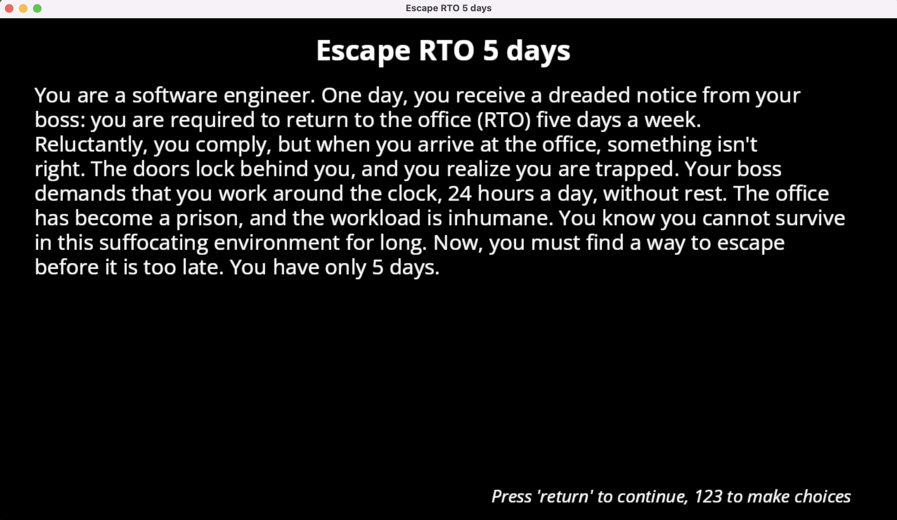

# Escape RTO 5 days

Author: Qiru Hu

Design: This game is inspired by a company's RTO 5 days policy. RTO means return to office. The game features a software engineer who is locked in a company that issues RTO 5 days policy and is forced to work 24 hrs a day. The software engineer must find a way out in 5 days or will become a permanent slave of the boss.

Text Drawing: (TODO: how does the text drawing in this game work? Is text precomputed? Rendered at runtime? What files or utilities are involved?)
The text is computed and rendered at runtime. Text rendering utility is implemented in Font.cpp and Font.hpp. The graphic pipeline that display a texture on a triangle is implemented in TextTextureProgram.hpp and TextTextureProgram.cpp. 

Font.hpp/cpp contain a class called Text which defines the text to render, the start position, line width and line height, and another class Font which contains FreeType and Harfbuzz objects to decode and shape text. 
In PlayMode.hpp/cpp, multiple Text objects are defined to indicate the position of title, manual, description, choices, and etc. As the game state changes, the vector of text objects are sent to the Font class (using gen_texture() function). Each text is separed into multiple lines as Harfbuzz cannot handle line breaks. Each line are shaped, and their bitmaps are copied to an image based on their position. The image is then passed to GPU by binding to a newly generated OpenGL texture. Therefore, all text rendering is done in runtime.

Choices: 
The game stores choices and narrative in a C++ class Story implemented in Story.hpp/cpp. The narrative and choices are stored in a std::unordered_map<std::string, std::string> texts object that map the text id (a short string) to the real text. The outcomes of a choice are stored in a std::unordered_map<std::string, std::vector<std::string> > choices object that map the choice text id to the possible outcomes.

The game rule, i.e. action+state->next state, is stored in get_next_state() and get_choice_outcome_text() function with if/else branches.

This reduces the trouble of parsing text files and make game status easy to access.

Screen Shot:

How To Play:
- Press return to continue.
- Press 1,2,3,4 to choose an option

Goal: escape the office

Player need to find the strategy and uncover the rule of the game via trial and error.
The game has multiple endings. Different choices lead to different endings. So player should be careful about their choices.

Sources: 
- Open Sans font: https://fonts.google.com/specimen/Open+Sans

This game was built with [NEST](NEST.md).

